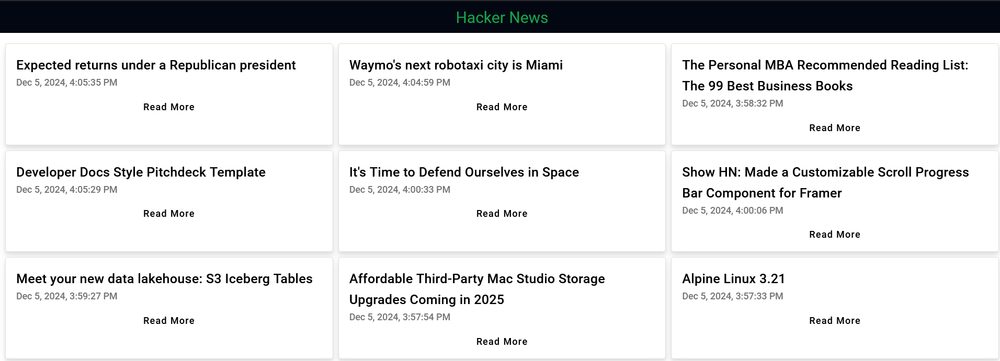

# Hacker News Project

This project was generated with [Angular CLI](https://github.com/angular/angular-cli) version 18.1.0.



## Description

Hacker News is a web application designed to display the latest tech news using the Hacker News API. It allows users to view the details of the top 10 news stories and load additional stories incrementally. This project demonstrates the use of Angular features, including component-based architecture, services, and external API integration.

## Features

- **Homepage**: Displays the latest 10 news stories, including:
  - Title with a link to the original source.
  - Publication date.
- **Incremental Loading**: Allows users to load 10 additional stories at a time by clicking the "Load More" button.
- **Performance Optimization**: Retrieves only the required data to ensure quick load times and efficient API usage.
- **Responsive Design**: Built with a mobile-first approach for seamless usage across devices.

## Technologies and External Libraries Used

- **Angular (v18)**: Framework used to build the web application.
- **Angular Material**: UI component library for styling (optional).
- **TailwindCSS**: For grid layout.

## Installation

### Prerequisites

- Node.js (v18 or higher) must be installed on your system.
- Angular CLI: Install it globally using the following command:

  ```bash
  npm install -g @angular/cli
  ```

### Steps to Set Up Locally

1. Clone the repository:

   ```bash
   git clone https://github.com/Tommaso-Desiato/hacker-news-project.git
   cd hacker-news-project
   ```

2. Install dependencies:

   ```bash
   npm install
   ```

3. Start the development server:

   ```bash
   ng serve
   ```

4. Open a browser and navigate to `http://localhost:4200/`.

## Deployment

This application is also deployed on Firebase for public access at this [link](https://hacker-news-52dfd.web.app/)

## Further Help

For more help with Angular CLI commands, use `ng help` or check the [Angular CLI Overview and Command Reference](https://angular.dev/tools/cli).

---
